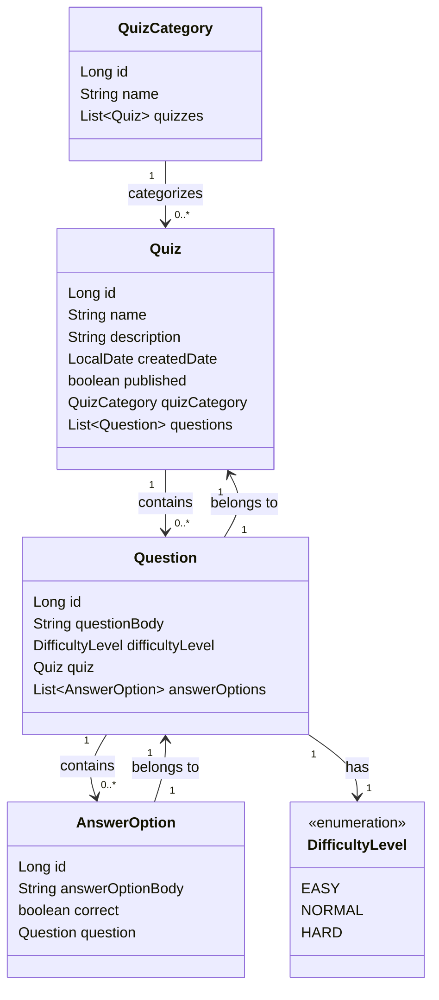

# Description

This project is a full-stack application built with Spring Boot and React.  
It aims to be used for creating educational quizzes, enabling teachers to create and manage quizzes, and students to participate and review their answers.

[The detailed project description](https://software-development-project-1.github.io/project-description)

## Installation

### Prerequisites

- Java 17 or above
- Node.js (version 14+)

### Clone the repository

```
git clone https://github.com/Team-417-Expectation-Failed/QuizzerApp.git
```

### Start the application

```
./mvnw spring-boot:run
```

## Data Model



## Contributing

Contact one of the team members below to learn how you can take part in this project.

## Team members

- [Kaito Stenroos](https://github.com/kaitostenroos)
- [Heli Kulomaa](https://github.com/helikulomaa)
- [Jehu Enberg](https://github.com/Comicalist)
- [Juuso Karjanlahti](https://github.com/juusokarjanlahti)
- [Jukka Virolainen](https://github.com/Jukalekvi)

## Backlog

https://github.com/orgs/Team-417-Expectation-Failed/projects/1/views/1
