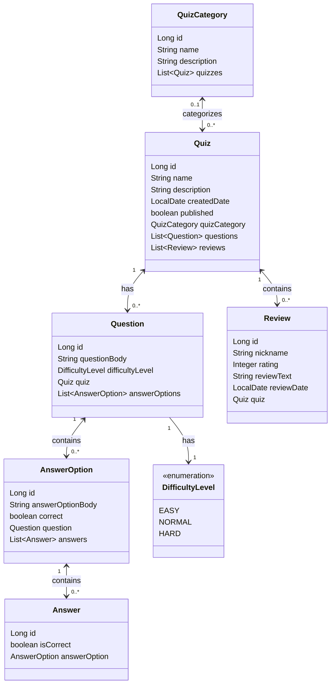

# Description

This project is a full-stack application built with Spring Boot and React.  
It aims to be used for creating educational quizzes, enabling teachers to create and manage quizzes, and students to participate and review their answers.

[The detailed project description](https://software-development-project-1.github.io/project-description)

[Final version of the application](https://quizzerapp-student-dashboard.onrender.com/)

## Installation

### Prerequisites

- Java 17 or above
- Node.js (version 14+) and npm
- Maven 3.8.4+

### Clone the repository

```
git clone https://github.com/Team-417-Expectation-Failed/QuizzerApp.git
cd QuizzerApp
```

### Start the Backend (Spring Boot)

```
./mvnw spring-boot:run
```

### Start the Frontend (React)

1. Navigate to the frontend folder:

    ```
    cd frontend
    ```

2. Install the necessary dependencies:

    ```
    npm install
    ```

3. Start the React development server:

    ```
    npm run dev
    ```
This will start the React application, which by default runs on **http://localhost:5173**.

## Data Model



## REST API

[Swagger documentation](http://localhost:8080/swagger-ui/index.html)

## Testing

Run all the tests in the same directory where the pom.xml is

```
mvn test
```

Run specific test classes with the name of the test class

```
mvn -Dtest=QuizzerRestControllerTest test
```

Run specific test method from a test class

```
mvn -Dtest=QuizzerRestControllerTest#createAnswerSavesAnswerForPublishedQuiz test
```

## Contributing

Contact one of the team members below to learn how you can take part in this project.

## Team members

- [Kaito Stenroos](https://github.com/kaitostenroos)
- [Heli Kulomaa](https://github.com/helikulomaa)
- [Jehu Enberg](https://github.com/Comicalist)
- [Juuso Karjanlahti](https://github.com/juusokarjanlahti)
- [Jukka Virolainen](https://github.com/Jukalekvi)

## Backlog

https://github.com/orgs/Team-417-Expectation-Failed/projects/1/views/1

## Licencing

The repository is licenced by [MIT licence.](https://github.com/Team-417-Expectation-Failed/QuizzerApp/blob/main/LICENCE.txt)
